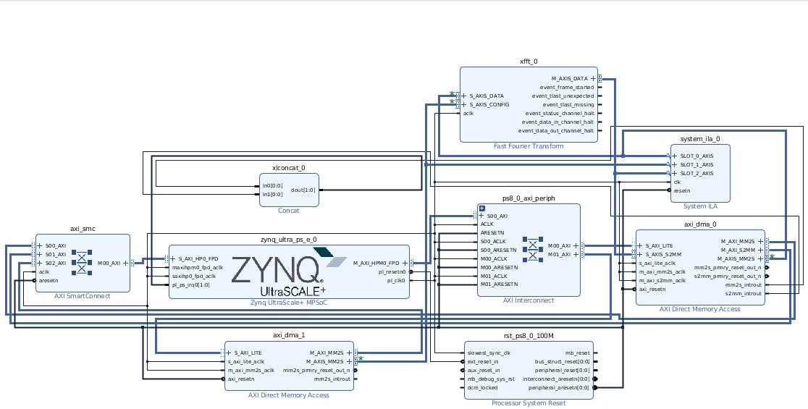

# AXI Stream DMA and xFFT project

## Description
On this project we will use DMA to connect Zynq MPSOC to PL xFFT IP to perform the Fast Fourier Transform of data stored on DDR.


Project developed for Trenz TE0802 board.



## Files
- **script/axis_dma_xfft.tcl.** Script to generate the Vivado project.
- **script/axis_dma_xfft_bd.tcl.** Script to generate block design of Vivado project.
- **c/main_fft.c.** Demo application used to verify the behavior.

## Creating the project.
To create the project, we have to open the corresponding Vivado version folder inside script folder, and then execute the next line on command window.
```
vivado -mode tcl -source ./axis_dma_xfft.tcl
```
Board file can be installed from Xilinx xHub Store.
